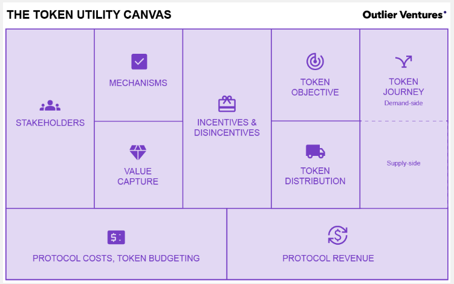

# Stakeholders

From: [https://outlierventures.io/token-utility-canvas/](https://outlierventures.io/token-utility-canvas/)

Before diving into the Token Utility Canvas, it is often helpful to prepare with a set of preliminary exercises. The token discovery workshop helps teams evaluate the potential for a token and gets them ready to fill out the Token Utility Canvas. The token discovery process answers the following key questions with 3 different exercises:&#x20;

1. What is the overall objective of the network or protocol?&#x20;
2. What are the most important stakeholders?
3. How do the different stakeholders exchange value?&#x20;

When it comes to the network objective, it is important to consider context, scope, and constraints, as well as defining criteria for success. We recommend representing stakeholders graphically, ordered according to their relative importance. The value exchange between stakeholders should be described in terms of the benefits for each stakeholder, as well as the mechanisms through which they exchange value.&#x20;

### Breaking down the Token Utility Canvas 

Once the token discovery step has been completed and we have clarity on objectives, stakeholders, and value exchange, we are ready to fill out the Token Utility Canvas. We will go through the different sections of the Token Utility Canvas one-by-one to provide more context on how the tool is used.&#x20;

### Stakeholders 

The first section of the Token Utility Canvas is to be populated with the outcomes of the stakeholder analysis conducted in the token discovery phase. Rather than a business serving a single customer, web3 networks and protocols often are n-sided networks, where different actors interact to create value. A typical list may include different types of users, providers of a decentralized service, investors, as well as the community at large. It is recommended to list them in order of importance.&#x20;
