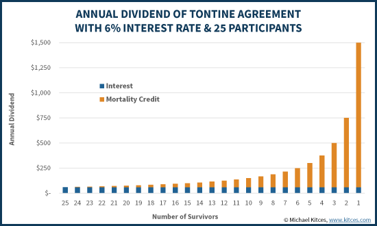

# Drey Fund Primer

## Tontines Explained

[Tontines](https://en.wikipedia.org/wiki/Tontine), a financial product with a rich history dating back to the 17th century, have recently been the subject of [much academic research](https://www.brookings.edu/research/retirement-tontines-using-a-classical-finance-mechanism-as-an-alternative-source-of-retirement-income/) due to their unique structure and potential benefits. Named after Lorenzo de Tonti, who popularized the concept in France, tontines pool the funds of participants and distribute the returns among the surviving members. This structure provides a lifetime income for participants and can potentially offer higher returns compared to other types of retirement savings plans. Originally designed as a strategy for government borrowing and financing, tontines have evolved over time and have recently seen a resurgence of interest due to their potential to address the underfunded pension crisis.

A tontine agreement involves investors contributing a lump sum to a pool, in exchange for ongoing payments or dividends as a return on their investment. These payments are typically made for life and end only at death. _However, the unique aspect of a tontine is that the payments that cease at the death of one investor are redistributed to the other investor participants, increasing their subsequent payouts_. This redistribution of shares from those who pass away to the survivors, known as 'mortality credits', is a core aspect of any lifetime annuity product. However, unlike annuities, tontines do not guarantee when mortality credits will be paid, eliminating the reserve requirements for companies that offer a tontine and potentially improving pricing for consumers.

The resurgence of interest in tontines is largely due to the growing public pension funding gap, projected to reach $400 trillion by 2050. Traditional annuities and pensions, with their low interest rates, inflationary fiat payments, and opaque solvency issues, are increasingly seen as inadequate for addressing this gap. Tontines, with their inherent longevity risk pooling and potential for higher returns, offer a promising alternative.

<figure><figcaption>
Figure 1. Closed-ended Tontine
</figcaption></figure>

### Brief History of Tontines

Tontines, a form of pooled investment fund, have a rich history dating back to the late 1600s. The Italian Lorenzo de Tonti invented a product to consolidate the French public-sector deficit in the early 1650s, which was introduced in 1689. His ideas were based on the pooling of persons by considering their mortality risk. The innovation was that, in exchange for a lump sum payment to the French government, one received the right to a yearly, lifelong pension, which increased over time because the yields were distributed among a lower number of surviving beneficiaries. The last survivor thus received the pensions of all others who died before.&#x20;

The use of tontines in the U.S. for retirement savings was popular in the late 1800s, with companies like Equitable Life Insurance Company leading the way. The explosive popularity of the tontine built the company into a behemoth. Soon thereafter, other insurance companies joined in, and by the early 1900s a whopping 9 million individuals in the U.S. owned tontine policies, the value of which amounted to an incredible 7.5% of _total_ national wealth at the time (roughly akin to the amount of U.S. national wealth in all IRAs today).

However, due to issues with fraudulent, opaque administration and exploitative fee structures due to the under-regulation of insurance companies, tontines fell out of favor in the early 1900s. Despite this, retirement researcher [Moshe Milevsky](https://en.wikipedia.org/wiki/Moshe\_Milevsky) argues that tontines are an idea worth resurrecting for the modern retirement era. Academic research proves time and again that because tontines do not pay mortality credits in advance of the deaths occurring, there's no risk of a tontine provider defaulting on its promised payments. This provides a better dollar-for-dollar return than what an annuity provides for a similar premium contribution.

## Blockchain Powered Tontines

Drey Finance's use of the Bitcoin blockchain and [zero knowledge proofs](https://www.horizen.io/academy/zero-knowledge-proofs-zkp/) enables the decentralization of tontine administration, eliminating the potential for abuse in fund administration which was problematic in previous tontine funds. **In a decentralized tontine, no single entity has control over the funds or the allocation of payouts and all calculations are public, the computations of which can be verified by zero knowledge proofs**. In other words, calculations are governed by off-chain smart contracts; self-executing programs with the terms of the agreement directly written into code whose computations emit zero knowledge proofs of correct computation. These proofs can be verified by anyone publicly. This ensures that the rules of the tontine are followed faithfully, enhancing trust and participation.

Administering pensions, annuities or tontines on the Bitcoin blockchain is a revolutionary idea that brings numerous benefits. Bitcoin's transparency, security, and immutability make it an ideal platform for tontine, annuity or pension administration. All transactions are recorded on the blockchain, making the operations transparent and auditable. This eliminates the potential for manipulation or fraud, a problem that has plagued traditional tontine administration.

Drey Finance leverages the power of Bitcoin to offer a modern, transparent, and secure fund structure. By combining the pooling of mortality-based life credits with the growth and income potential of liquidity providing to the Lightning Network, Drey Finance delivers stable high income returns with low risk. The integration of artificial intelligence into Drey Finance's operations further enhances efficiency, accuracy, and user experience, making Drey Finance's fund structure a truly innovative solution for the 21st century.

<figure><figcaption>
Figure 2. Lifetime Annuity vs Tontine Agreement
</figcaption></figure>

## Drey Funds: Better By Design

A Drey Fund combines a tax efficient gifting mechanism with a pay-out scheme. Like a tontine, a customer's deposit into the Drey Fund is a gift to all present and future members within the fund and is irrevocable. The customer agrees that upon his/her passing away, the bitcoin balances are transferred to all other customers in the Drey Fund, split according to an allocation formula that is published on the bitcoin blockchain. As long as the customer is alive, he/she will collect a longevity yield like the kind shown in Figures 1 and 2 above.

Closed pool tontines, as shows in Figure 1 and 2, are a bit like lotteries. The last survivors win big. However, lottery-like payoffs are not ideal for retirement or inheritance planning, where a smoother distribution curve is more attractive.&#x20;

A Drey Fund is different to a closed pool tontine, by design, and improves upon the tontine's structure in a number of ways. First, it is an open-ended tontine, able to continually accept new participants and running in perpetuity. Second, payouts self-adjust so that the fund is naturally funded at all times, 100% of the time. The self-adjustment mechanism happens monthly through an allocation formula called [Dreybits monthly allocation](Operations.md#dreybits), covered in detail in a following section.

A Drey Fund pools and diversifies individual longevity risk that forces insurers and annuity providers to maintain large risk reserves, the cost of which they pass on to their customers. A Drey Fund is substantially less expensive from a fee standpoint that your traditional annuity or pension because there is no guaranteed premium or reserve. The other benefit being that since there is no reserve to depend on, there is no counterparty risk. In industry technical terms, a **Drey Fund is an actuarially-fair, non-insured annuity denominated in bitcoin.**

## Drey Funds: Actuarially Fair

A tontine is fair when the expected value of each member’s “tontine gains/losses” is zero at all times. In other words, the gains are longevity credits they receive while living, and the loss is the balance forfeited at death. How is this fairness maintained? Simple. There are no intergenerational transfers of bitcoin from one party to the other. The strictness comes from customers continually 'checking in' with the fund, on a monthly basis, to prove that they are still living and entitled to their distribution. Within Drey, this accomplished by the user's interaction with the Drey iOS/Android app, i.e., performing 'Proof of Life.' Why is this important?

Well, for one, by maintaining strict actuarial fairness and a strict fully-funded budget constraint a Drey Fund is sustainable forever. Secondly, it enables the mixing of different cohorts within the fund, so that a Drey Fund can support different ages, sexes, investment amounts and even geographies (as long as there is industry accepted accurate actuarial data for that geography). Third, it enables the 'open-ended' aspect of the fund, ever increasing the deposit base.

Lastly, a Drey Fund is denominated in bitcoin. Assuming bitcoin continues its performance this decade nearly to what it did last decade, then a Drey Fund is potentially a hedge against inflation risk as well.

A Drey Fund provides a secure, transparent, and efficient way to generate a lifetime income, making them an attractive option for individuals, couples, and families seeking financial security in retirement on inheritance planning. With its blockchain-based annuity, Drey Finance is at the forefront of this financial revolution, ready to redefine inheritance and retirement income and in the digital age.

## References

Donnelly, C. (2015). Actuarial fairness and solidarity in pooled annuity funds. ASTIN Bulletin, 45(01):49–74.

Donnelly, C., Guillén, M., and Nielsen, J. P. (2013). Exchanging uncertain mortality for a cost. Insurance: Mathematics and Economics, 52(1):65–76.

Donnelly, C., Guillén, M., and Nielsen, J. P. (2014). Bringing cost transparency to the life annuity market. Insurance: Mathematics and Economics, 56:14–27.

Forman, J. B. and Sabin, M. J. (2015). Tontine pensions. University of Pennsylvania Law Review, 173(3):755-831.

Forman, J. B. and Sabin, M. J. (2016). Survivor funds. Pace Law Review, 37(1).

Goldsticker, R. (2007). A Mutual Fund to Yield Annuity-Like Benefits. Financial Analysts Journal, 63(1):63–67.

Gründel, H. and Wandt, M. (July 6, 2017). The modern tontine: An innovative instrument for longevity risk management in an aging society. ICIR Working Paper Series No. 22/2016.

Kantorowicz, E. H. (1957). The King’s Two Bodies: A Study in Mediaeval Political Theology, Princeton University Press, Princeton, NJ, 411-412.

Milevsky, M. A. and Salisbury, T. S. (2015). Optimal Retirement Income Tontines. Insurance: Mathematics and Economics, 64:91–105.

Milevsky, M. A. and Salisbury, T. S. (2016). Equitable retirement income tontines: Mixing cohorts without discriminating. ASTIN Bulletin, 46(3):571-604.

NAIC (2013). NAIC model rule (regulation) for recognizing a new annuity mortality table for use in determining reserve liabilities for annuities. National Association of Insurance Commissioners.

Piggott, J., Valdez, E. A., and Detzel, B. (2005). The simple analytics of a pooled annuity fund. Journal of Risk and Insurance, 72(3):497–520.

Sabin, M. J. (March 26, 2010). Fair tontine annuity. Available at SSRN: https://ssrn.com/abstract=1579932 or https://dx.doi.org/10.2139/ssrn.1579932.

Sabin, M. J. and Forman, J. B. (November 9, 2016). The analytics of a single-period tontine. Available at SSRN: https://ssrn.com/abstract=2874160 or https://dx.doi.org/10.2139/ssrn.2874160.

Stamos, M. Z. (2008) Optimal consumption and portfolio choice for pooled annuity funds. Insurance: Mathematics and Economics, 43(1):56–68.

Waring, M. B. and Seigel, L. B. (2015). The Only Spending Rule Article You Will Ever Need. Financial Analysts Journal, 71(1):91–107.
